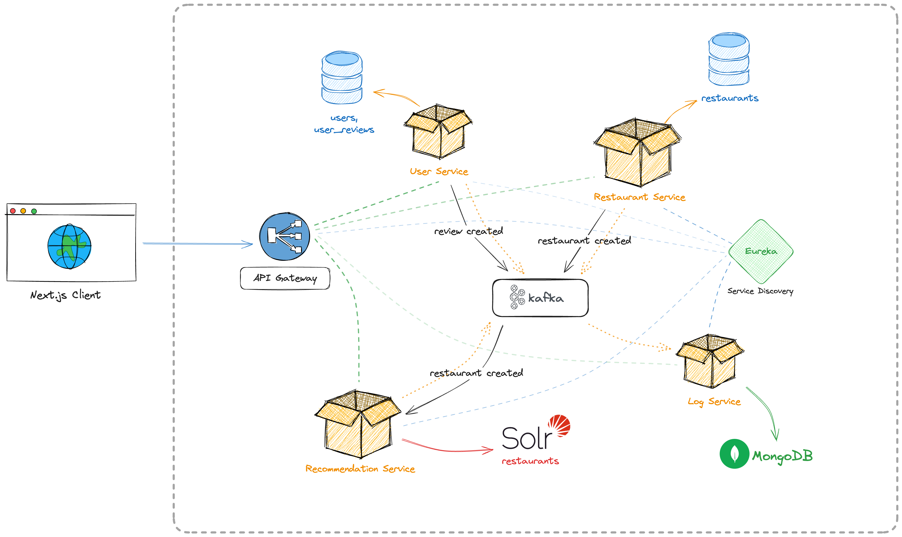
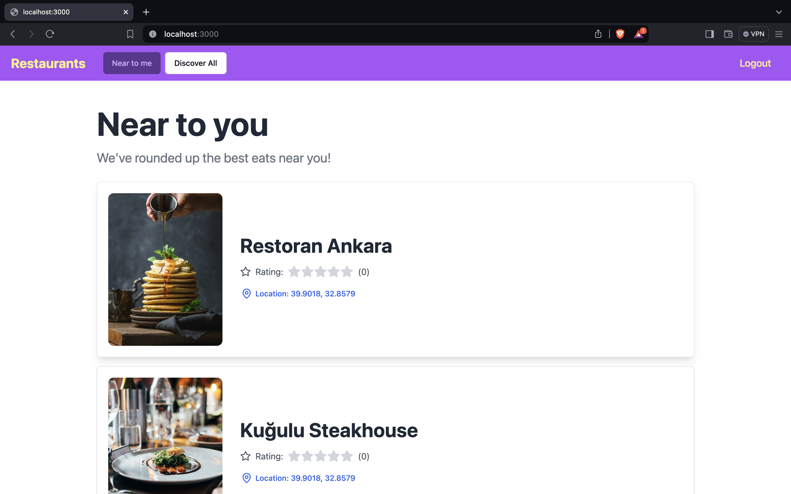
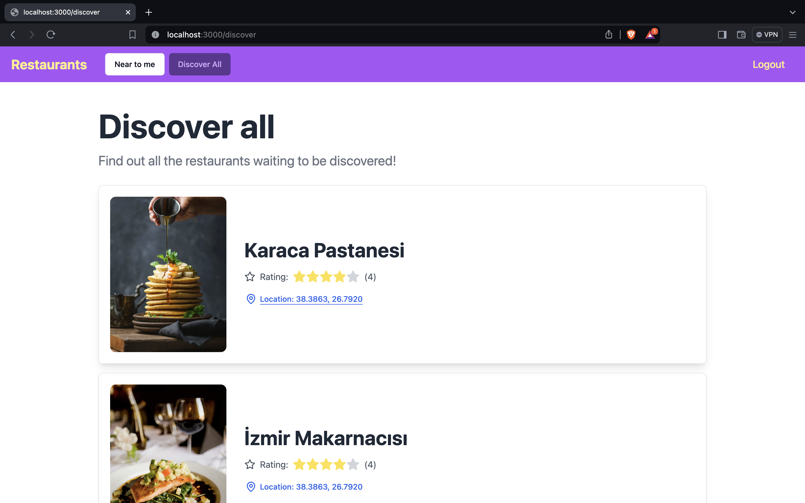
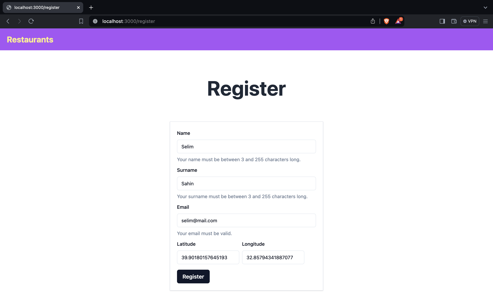

# Final Projesi - n11 TalentHub Bootcamp 👑

Bu proje, n11 TalentHub Backend Bootcamp'inin final projesidir. Apache Solr üzerine inşa edilmiş bir restoran öneri sistemi içerir.
Mikroservis mimarisi uygulanarak geliştirilmiştir.

LinkedIn: [Selim Şahin](https://www.linkedin.com/in/selim-sahin/) 
LeetCode: [selimsahin](https://leetcode.com/selimsahin/) 
Email: [selimsahin.sns@gmail.com](mailto:selimsahin.sns@gmail.com)

## Kısaca Bazı Özellikler

- Unit ve Integration testleri yazıldı.
- Her temel servisin kendi veritabanı bulunuyor.
- Kafka ile asenkron mesajlaşma sağlandı.
- Loglar için MongoDB kullanılıyor.
- Eureka service discovery yapısı hazırlandı.
- Next.js ile oluşturulmuş basit bir önyüze sahip.
- docker-compose.yml dosyası hazırlandı.
- Swagger API dokümantasyonu eklendi. 
- Postman üzerinden denenebilir.

Projeyi `Docker` kullanarak nasıl çalıştırabileceğinizi öğrenmek için [Docker](#docker) bölümünü inceleyiniz.

## Postman ile deneyin
API adreslerini Postman ile deneyebilirsiniz: [**Postman API** 🚀](https://www.postman.com/selimsahindev/workspace/selim-ahin-n11-talenthub-bootcamp)

- Ekranın sağ üstünden n11 environment'ı seçmeniz gerekmekte.

## Mikroservisler

Aşağıda projeye ait mikroservislerin listesi bulunmaktadır. 
 📦 User Service
 📦 Restaurant Service
 📦 Recommendation Service
 🐝 Log Aggregation Service
 ⛩️ API Gateway
 🌐 Eureka Service Discovery

## Proje Şeması

# Docker

Projeyi çalıştırmak için Docker kullanabilirsiniz. [Docker](https://www.docker.com/products/docker-desktop) sayfasından docker'ı indirebilirsiniz.

## Projeyi ayağa kaldıralım

1. Terminalinizi açın ve projenin ana dizinine gidin.
2. `docker-compose up -d` komutunu çalıştırın.
3. Tüm servislerin başlatılmasını bekleyin. (Epey sürebilir, sabırlı olun...)
4. Tüm servislerin başlatıldığını gördüğünüzde, API kullanılabilir durumda demektir (umarım)
5. Next.js projesini çalıştırmak için bir sonraki adımda yer alan [Next.js](#next.js) bölümüne bakınız.

Kapatmak için terminalinizden projenin ana dizinine gidin ve `docker-compose down` komutunu çalıştırın.

Projeyi çalıştırmak için Docker'ın yeterli olacağını düşünüyorum. Ancak, önyüz projesini çalıştırmak için Node.js ve npm gerekecektir.

# Next.js

Next.js projesi, basit bir önyüz sunar. Bu önyüz, kullanıcıların kendilerine yakın restoran önerilerini ve diğer restoranları görmelerini sağlar.

## Önyüzü çalıştırma adımları

1. Terminalinizi açın ve projenin ana dizinine gidin.
2. `cd nextjs-frontend` komutunu çalıştırarak önyüz projesinin dizinine gidin.
3. `npm install` komutunu çalıştırın gerekli paketlerin yüklenmesini bekleyin.
4. `npm run dev` komutunu çalıştırarak önyüz projesini başlatın.
5. Tarayıcınızda `http://localhost:3000` adresine gidin.

Bu noktaya geldiyseniz harika! Artık projeyi kullanabilirsiniz. 🎉🎉🎉

Dokümanın ilerleyen kısımlarında API dokümantasyonu ve servis açıklamaları yer alıyor.

# Kullanıcı Servisi - [User Service](user-service)

Kullanıcı modülü, kendine ait bir PostgreSQL veritabanı kullanarak kullanıcı verisiyle ilgili sorumluluklarını yerine getiren bir temel (foundational) mikroservistir.

Servis sınıfıyla mikroservislerin karışmaması adına onları ".java" olarak belirttim.

## UserService ([UserService.java](user-service/src/main/java/com/selimsahin/userservice/service/UserService.java))

Kullanıcı servisi, kullanıcı yönetimi ile ilgilenir. Kullanıcı oluşturma ve silme ve güncelleme işlemlerini sağlar.

### API Adresleri

| Method | Adres                           | Açıklama                   |
|--------|---------------------------------|----------------------------|
| `GET`  | `user-service/api/v1/users`     | Kullanıcıları getir        |
| `GET`  | `user-service/api/v1/users/{id}` | Kullanıcı id'si ile getir  |
| `POST` | `user-service/api/v1/users`     | Yeni bir kullanıcı oluştur |
| `PUT`  | `user-service/api/v1/users/{id}` | Kullanıcıyı güncelle       |
| `DELETE`| `user-service/api/v1/users/{id}` | Kullanıcıyı sil            |

## UserReviewService ([UserReview.java](user-service/src/main/java/com/selimsahin/userservice/service/UserReviewService.java))

Kullanıcı yorumları servisi, kullanıcıların restoranlar hakkında yaptığı yorumları yönetir. Kullanıcı yorumları oluşturma, silme ve güncelleme işlemlerini sağlar.

### API Adresleri

| Method | Adres                                                  | Açıklama                   |
|--------|--------------------------------------------------------|----------------------------|
| `GET`  | `user-service/api/v1/user-reviews`                     | Kullanıcı yorumlarını getir        |
| `GET`  | `user-service/api/v1/user-reviews/{id}`                | Kullanıcı yorum id'si ile getir  |
| `GET`  | `user-service/api/v1/user-reviews/by-user?userId={id}` | Kullanıcı id'si ile yorumları getir  |
| `POST` | `user-service/api/v1/user-reviews`                     | Yeni bir kullanıcı yorumu oluştur |

# Restoran Servisi - [Restaurant Service](restaurant-service)

### API Adresleri

| Method | Adres                                 | Açıklama                   |
|--------|---------------------------------------|----------------------------|
| `GET`  | `user-sevice/api/v1/restaurants`      | Restoranları getir         |
| `GET`  | `user-sevice/api/v1/restaurants/{id}` | Restoran id'si ile getir  |
| `POST` | `user-sevice/api/v1/restaurants`      | Yeni bir restoran oluştur  |
| `DELETE`| `user-sevice/api/v1/restaurants/{id}` | Restoranı sil            |

# Öneri Servisi - [Recommendation Service](recommendation-service)

Öneri servisi, kullanıcıların restoranlar hakkında yaptığı yorumları ve konumlarını kullanarak restoran önerileri sunar. Bu önerileri sunarken Apache Solr kullanır.

### API Adresleri

| Method | Adres                                                                         | Açıklama                                            |
|--------|-------------------------------------------------------------------------------|-----------------------------------------------------|
| `GET`  | `recommendation-service/api/v1/search/restaurants`                            | Solr'daki tüm restoranları getir                    |
| `GET`  | `/api/v1/search/restaurants/by-location-near?location={latitude},{longitude}` | Belirtilen konuma yakın en fazla üç restoranı getir |

# Log Toplama Servisi - [Log Aggregation Service](log-aggregation-service)

Log toplama servisi, diğer mikroservislerden üretilen hata ve bilgi loglarını toplar ve MongoDB veritabanına kaydeder.
Bunlara erişmek için bir API sunar. MongoDB veritabanınızı yönetmek için projede Mongo Express de bulunuyor.
Detaylı bilgi almak için [Mongo Express](#mongo-express) bölümüne bakınız.

### API Adresleri

| Method | Adres                                      | Açıklama              |
|--------|--------------------------------------------|-----------------------|
| `GET`  | `log-aggregation-service/api/v1/info-logs` | Bilgi loglarını getir |
| `GET`  | `log-aggregation-service/api/v1/error-logs`| Hata loglarını getir  |

# API Gateway - [API Gateway](api-gateway)

API Gateway, diğer mikroservislerin API'lerini tek bir noktadan erişilebilir hale getirir. Ayrıca servislerin bulunduğu adresleri Eureka üzerinden alır.

# Eureka Sunucusu - [Eureka Server](eureka-server)

Eureka sunucusu, diğer mikroservislerin kayıt olduğu ve bulunduğu adresleri tutan bir servistir. API Gateway, Eureka üzerinden diğer servislerin adreslerini alır.

## Mongo Express

MongoDB veritabanınızı yönetmek için kullanabileceğiniz bir web tabanlı arayüzdür.

## Mongo Express arayüzü ve kullanımı

1. Docker projeniz ayaktayken tarayıcınızda `http://localhost:8081` adresine gidin.
2. Varsayılan kullanıcı adı ve parola `admin` : `pass` şeklindedir.
3. MongoDB veritabanınızı seçin ve yönetmeye başlayın.

## Projenin Önyüzü

### "Near to you" Sayfası
Bu sayfada kullanıcılar, yakınlarında bulunan ve ortalama puanı en yüksek olan üç restoranı görebilirler.

### "Discover all" Sayfası
Bu sayfasda, kullanıcıların var olan tüm restoranları keşfedebilecekleri bir liste bulunur.

### "Registration" Sayfası
İçimizi ısıtan bir register sayfası...

 

## n11 x Patika.dev TalentHub Bootcamp

LinkedIn: [Selim Şahin](https://www.linkedin.com/in/selim-sahin/) 
LeetCode: [selimsahin](https://leetcode.com/selimsahin/) 
GitHub: [selimsahindev](https://github.com/selimsahindev)
Mail: [Gmail](mailto:selimsahin.sns@gmail.com)