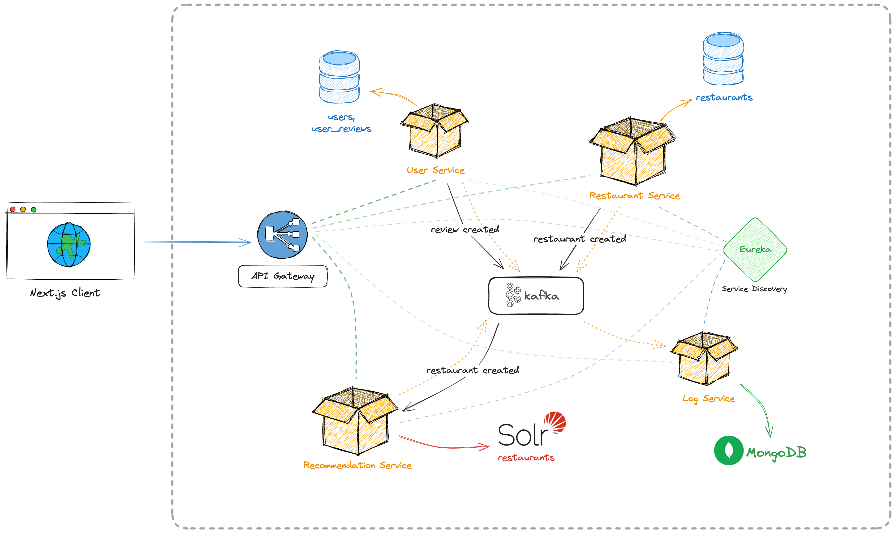
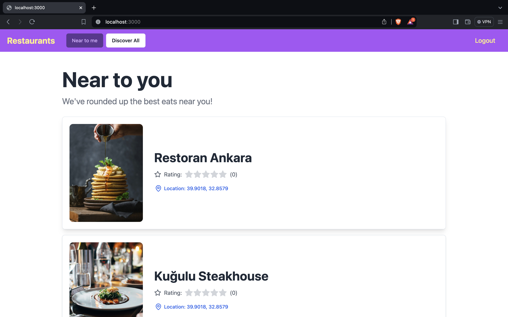
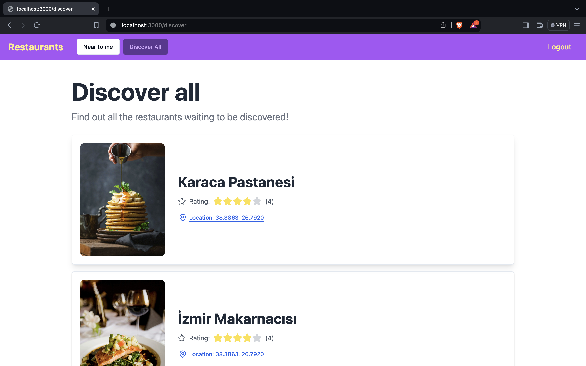
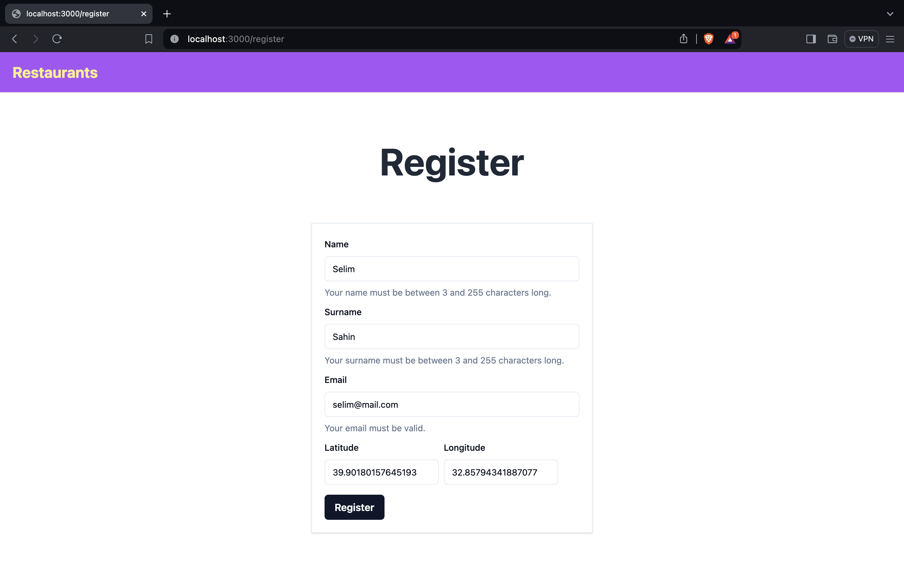

# Final Project — n11 TalentHub Bootcamp 👑

This is the final project of the n11 TalentHub Backend Bootcamp. It features a restaurant recommendation system built on top of Apache Solr, developed using a microservices architecture.

LinkedIn: [Selim Sahin](https://www.linkedin.com/in/selim-sahin/)  
GitHub: [selimsahindev](https://github.com/selimsahindev/)

---

## Highlights

- Unit and integration tests are written.
- Each core service has its own dedicated database.
- Asynchronous messaging is handled via Kafka.
- MongoDB is used for log storage.
- Eureka service discovery is configured.
- A simple frontend is built with Next.js.
- A `docker-compose.yml` file is provided.
- Swagger API documentation is included.
- The API can be tested via Postman.

To learn how to run the project with Docker, see the [Docker](#docker) section.

---

## Try It with Postman

You can test all API endpoints using Postman: [**Postman API** 🚀](https://www.postman.com/selimsahindev/workspace/selim-ahin-n11-talenthub-bootcamp)

---

## Microservices

The following microservices are part of the project:

- 📦 User Service
- 📦 Restaurant Service
- 📦 Recommendation Service
- 🐝 Log Aggregation Service
- ⛩️ API Gateway
- 🌐 Eureka Service Discovery

---

## Project Architecture Diagram

---

## Docker

You can run the project using Docker. Download Docker Desktop from the [official Docker website](https://www.docker.com/products/docker-desktop).

### Starting the Project

1. Open a terminal and navigate to the root directory of the project.
2. Run `docker-compose up -d`.
3. Wait for all services to start. (This may take a while — be patient.)
4. Once all services are up, the API should be ready to use.
5. To run the frontend, refer to the [Next.js](#nextjs) section below.

To stop the project, navigate to the root directory and run `docker-compose down`.

> **Note:** Docker is sufficient to run the backend. However, running the frontend requires Node.js and npm.

---

## Next.js

The Next.js project provides a simple frontend that allows users to view nearby restaurant recommendations and browse all available restaurants.

### Running the Frontend

1. Open a terminal and navigate to the root directory of the project.
2. Run `cd nextjs-frontend` to enter the frontend directory.
3. Run `npm install` and wait for dependencies to be installed.
4. Run `npm run dev` to start the development server.
5. Open your browser and go to `http://localhost:3000`.

If you've made it this far — great! You're all set. 🎉🎉🎉

---

## User Service — [user-service](user-service)

The User Service is a foundational microservice responsible for user data management. It uses its own dedicated PostgreSQL database.

> Service class names are suffixed with `.java` to distinguish them from the microservices themselves.

### UserService ([UserService.java](user-service/src/main/java/com/selimsahin/userservice/service/UserService.java))

Handles user management, including creation, update, and deletion operations.

#### API Endpoints

| Method   | Path                              | Description             |
|----------|-----------------------------------|-------------------------|
| `GET`    | `user-service/api/v1/users`       | Get all users           |
| `GET`    | `user-service/api/v1/users/{id}`  | Get user by ID          |
| `POST`   | `user-service/api/v1/users`       | Create a new user       |
| `PUT`    | `user-service/api/v1/users/{id}`  | Update a user           |
| `DELETE` | `user-service/api/v1/users/{id}`  | Delete a user           |

### UserReviewService ([UserReviewService.java](user-service/src/main/java/com/selimsahin/userservice/service/UserReviewService.java))

Manages user reviews for restaurants, including creation, update, and deletion.

#### API Endpoints

| Method | Path                                                     | Description                        |
|--------|----------------------------------------------------------|------------------------------------|
| `GET`  | `user-service/api/v1/user-reviews`                       | Get all user reviews               |
| `GET`  | `user-service/api/v1/user-reviews/{id}`                  | Get a review by ID                 |
| `GET`  | `user-service/api/v1/user-reviews/by-user?userId={id}`   | Get all reviews by a specific user |
| `POST` | `user-service/api/v1/user-reviews`                       | Create a new user review           |

---

## Restaurant Service — [restaurant-service](restaurant-service)

### API Endpoints

| Method   | Path                                      | Description              |
|----------|-------------------------------------------|--------------------------|
| `GET`    | `restaurant-service/api/v1/restaurants`       | Get all restaurants      |
| `GET`    | `restaurant-service/api/v1/restaurants/{id}`  | Get a restaurant by ID   |
| `POST`   | `restaurant-service/api/v1/restaurants`       | Create a new restaurant  |
| `DELETE` | `restaurant-service/api/v1/restaurants/{id}`  | Delete a restaurant      |

---

## Recommendation Service — [recommendation-service](recommendation-service)

The Recommendation Service provides restaurant suggestions based on user reviews and location data, powered by Apache Solr.

### API Endpoints

| Method | Path                                                                            | Description                                          |
|--------|---------------------------------------------------------------------------------|------------------------------------------------------|
| `GET`  | `recommendation-service/api/v1/search/restaurants`                              | Get all restaurants indexed in Solr                  |
| `GET`  | `/api/v1/search/restaurants/by-location-near?location={latitude},{longitude}`   | Get up to three nearby restaurants at a given location |

---

## Log Aggregation Service — [log-aggregation-service](log-aggregation-service)

This service collects error and info logs produced by other microservices and stores them in a MongoDB database. A REST API is provided to access the stored logs. The project also includes Mongo Express for managing the MongoDB database — see [Mongo Express](#mongo-express).

### API Endpoints

| Method | Path                                          | Description          |
|--------|-----------------------------------------------|----------------------|
| `GET`  | `log-aggregation-service/api/v1/info-logs`    | Get all info logs    |
| `GET`  | `log-aggregation-service/api/v1/error-logs`   | Get all error logs   |

---

## API Gateway — [api-gateway](api-gateway)

The API Gateway exposes all microservice APIs through a single unified entry point and resolves service addresses dynamically via Eureka.

---

## Eureka Server — [eureka-server](eureka-server)

The Eureka Server acts as a service registry where all microservices register themselves. The API Gateway uses Eureka to discover and route requests to the appropriate services.

---

## Mongo Express

Mongo Express is a web-based UI for managing the MongoDB database included in this project.

### Accessing Mongo Express

1. With Docker running, open your browser and go to `http://localhost:8081`.
2. Default credentials: username `admin`, password `pass`.
3. Select your MongoDB database and start managing it.

---

## Frontend Screens

### "Near to You" Page
Users can see the top three highest-rated restaurants closest to their location.

### "Discover All" Page
Users can browse the full list of available restaurants.

### "Registration" Page
A warm and welcoming registration screen.

---

## n11 × Patika.dev TalentHub Bootcamp

LinkedIn: [Selim Sahin](https://www.linkedin.com/in/selim-sahin/)  
GitHub: [selimsahindev](https://github.com/selimsahindev/)
